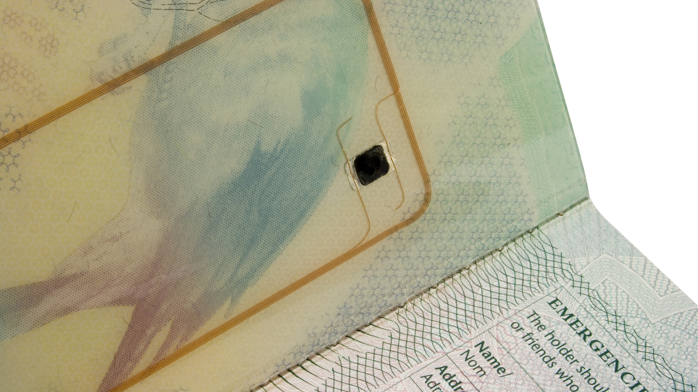
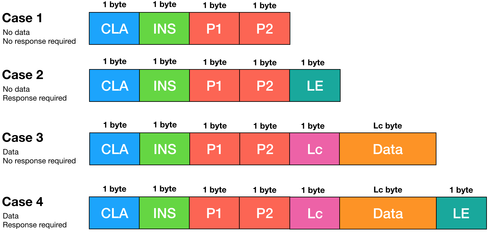
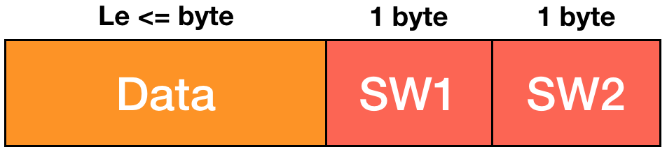
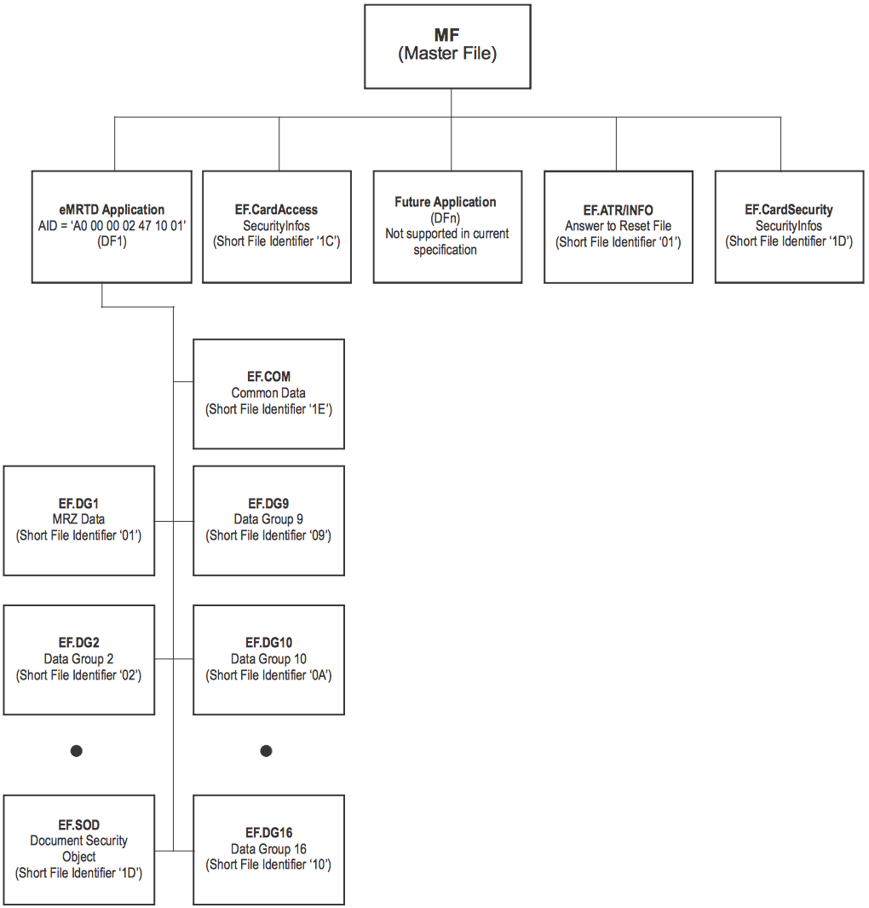
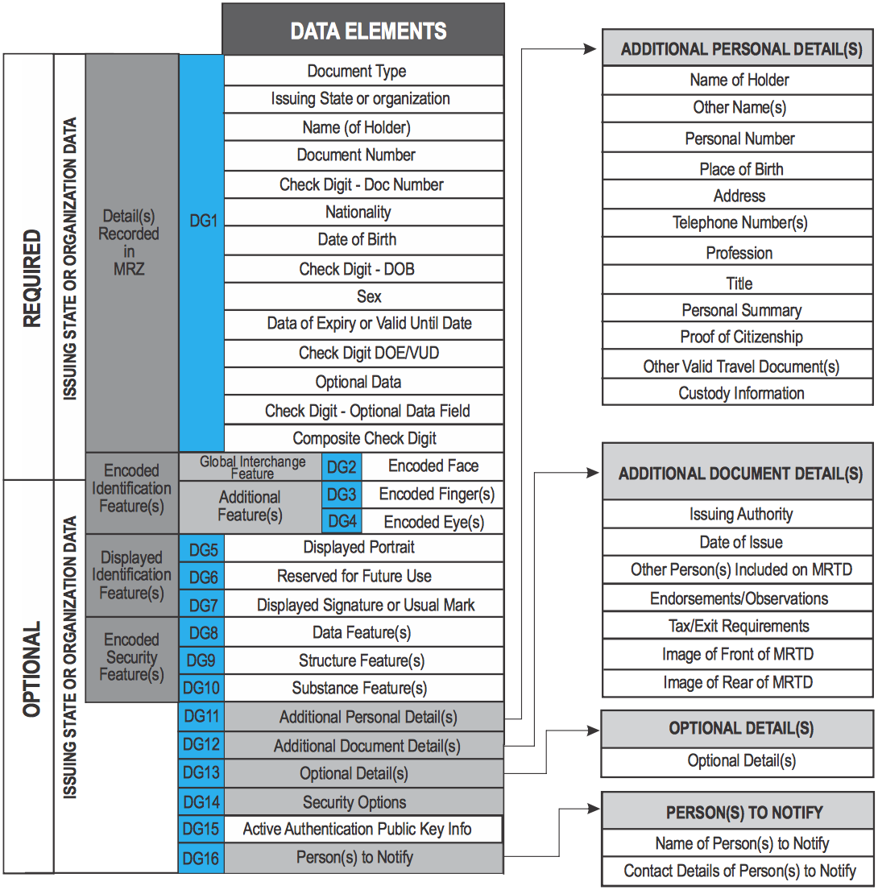
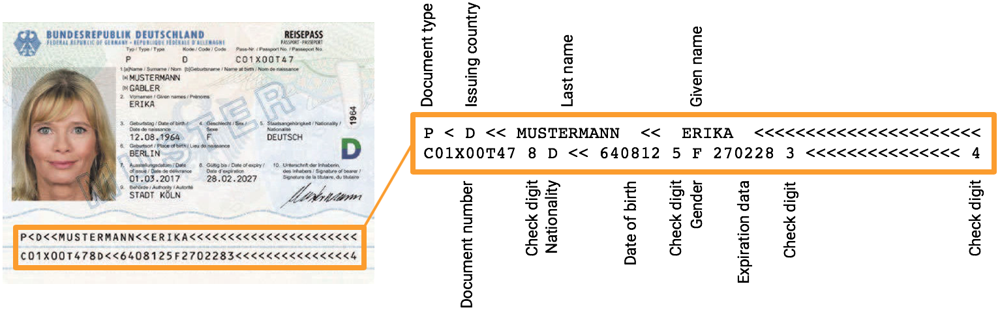
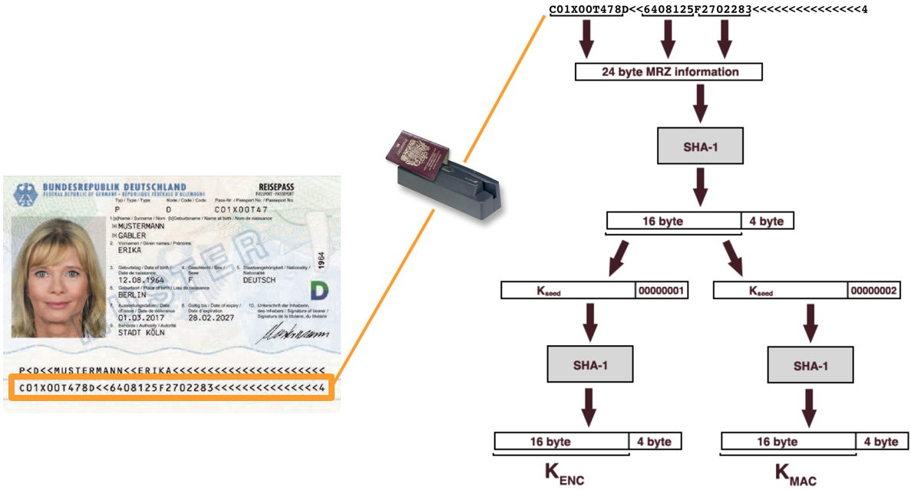
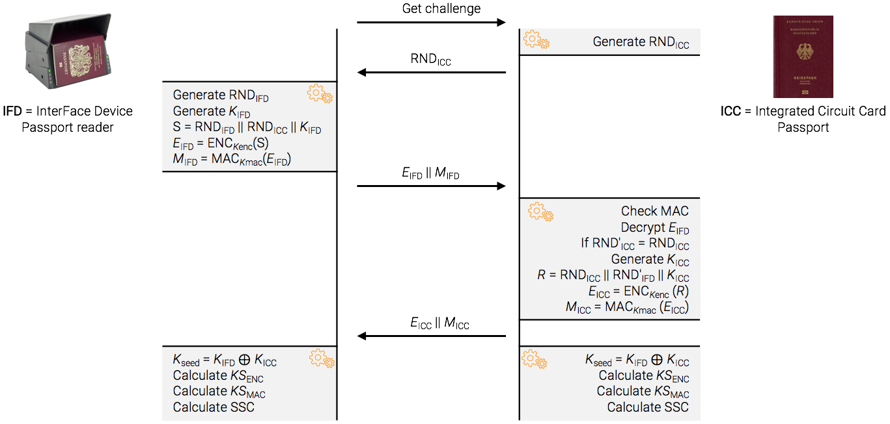

Read your passport
==================

My first job after finishing my MSc. in Ethical Hacking and Computer Security was at the University of Louvain (BE) as Research Engineer. I worked on the security of electronic passport. At the end of the project, we released a [scientific paper](https://www.researchgate.net/publication/286047538_A_Survey_of_Security_and_Privacy_Issues_in_ePassports) in the ACM journal together with a python tool to read and execute attack on electronic passport. Later, I also gave a short [talk](https://beaujeant.github.io/resources/publications/epassport-security.pdf) about passport security. The tool was initially hosted on Google Code, but since the service has been decommissioned, I re-uploaded the code to [Github](https://github.com/beaujeant/ePassportViewer). I guess whenever I get some time, I will refresh a bit the project. But today, I just wanted to give a _short_ introduction of how to read the content of your passport.


Technical introduction
----------------------

Most of European passport contains a RFID chip. As you can see a the back of my passport, we can clearly see the shape of the antenna and the ship.




In order to use common tools to verify the authenticity of the documents from different nationalities across different borders, countries follows the International Civil Aviation Organization (ICAO) recommendations. ICAO is a United Nation specialized agency that codifies principles and techniques of international air navigation, including passport standards. This means the documents itself but also the RFID chip.

The RFID chip should be compliant with ISO/IEC 14443, which defines:

* The physical characteristics
* The radio frequency power and signal interface
* The initialization and anti collision mechanisms
* The transmission protocol

Maybe the most important to remember here is the frequency used to communicate: 13.56MHz.


Passport communication
----------------------

The protocol used for the communication between the passport and reader is defined by the ISO/IEC 7816-4. To make it simple, it is a command (from reader) <-> response (from chip) protocol. The command looks like this:



* __CLA__: Instruction class (type of command)
* __INS__: Instruction code (specific command)
* __P1__-__P2__: Instruction parameters for the command
* __Lc__: Length of data (byte)
* __Data__: Command data (length = __Lc__)
* __Le__: Max length (byte) expected for response


And the response looks like this:



* __Data__: Response data (length <= __Le__)
* __SW1__-__SW2__: Command processing status


Passport content
----------------

The content structure of the passport, defined in the ICAO Doc 9303 (also known as ISO/IEC 7501-1). The Doc 9303 is composed of 12 parts, and for this chapter, we will have a closer look at "Part 10: Logical Data Structure (LDS) for Storage of Biometrics and Other Data in the Contactless Integrated Circuit (IC)".

See the content of the chip as a file system. The file system is organized hierarchically into _Dedicated Files_ (DFs) and _Elementary Files_ (EFs). Dedicated files are kind of folder, since it can contains DF and EF, while Elementary Files contain data. After the selection of a DF, the DF and EF within this DF can be accessed.

The file system is organized as follow: First, we have the root folder known as the _Master File_ (MF). The MF contains multiple Dedicated Files. Each of them a responsible for a specific application. Electronic passport should have at least one application: the "electronic Machine Readable Travel Document" (eMRTD). Within the eMRTD DF, you should find the following elementary files:

* A table of content (`EF.COM`)
* Up to 16 Data Groups (DG) that contain the holder and issuing country information (`EF.DG1`, `EF.DG2`, ...)
* A Security Object Document (`EF.SOD`) that contains the signature for each DGs



Data Groups (DG) is where the interesting information is stored. Only the two first data group are mandatory.   



All elementary files are in the form of data templates and have individual ASN.1 Tags. Each elementary files consists of a series of data objects within a template. Individual data objects from the elementary file can be retrieved directly after the relative position within the transparent file has been determined.


Passport security
-----------------

When dealing with passport, there are multiple aspects you want to protect. From the issuing country perspective, you want to prevent people from forging new fake documents or copying existing ones. From the citizen perspective, you want to prevent unauthorized people from reader the content or to copy your passport. Multiple security measures are in place to prevent that.

### Basic Access Control

Let's start with the reading restriction. In order to read the content of the chip, you first need to know the shared "secret". The secret is actually the Machine Readable Zone (MRZ), the area padded with `<` that contains the mains information of the passport.



Once read (usually with an [OCR machine](https://www.access-is.com/products/ocr315e-ocr316e)), two temporary keys are derived from the MRZ based on the _passport number_, _date of birth_ and _expiration date_.



Those keys will always be the same since no random values are used for derivation. So whether my passport is read in Germany then read again in Belgium two years later, `Kenc` and `Kmac` will always be the same. That's why those keys are only used during the process for generating sessions keys.



* `RND` = Random Number (8-bytes)
* `K` = Key (16 bytes)
* `M` = MAC (8 bytes)
* `ENC` = 3DES encryption
* `MAC` = MAC Algorithm 3
* `KS` = Final keys for session
* `SSC` = Send Sequence Counter

Sessions keys are used on both side for the communication between the reader and the passport. If the passport is removed from the reader, the keys are lost and new ones will have to be generated next time we want to communicate with the passport.

In summary, the BAC authenticate anyone who knows the passport number, date of birth and expiration date; then it generates session keys used for the encryption of the communication.

### Passive authentication

In order to prevent people from editing their passport or forging fake ones, the hashes of each Data Group are stored in the `EF.SOD`. The list of hashes is then signed with (one of) the country private key and the signature is also stored in the `EF.SOD` together with the document signer certificate.

Here is the process to verify the integrity of the passport:

1. The reader extract from the `EF.SOD` the list of hashes, the signature and the document signer certificate.
2. The reader verify the document signer certificate is issued by the country (they need prior agreement with the issuing country to obtain a trusted certificate to validate the validity of the document signer certificate)
3. The reader verify signature for the list of hashes
4. When reading a Data Group, the reader will verify the hash

So this system provide a mechanism for authorities (foreign or local) to verify the integrity of the passport as long as they have an agreement with he issuing authorities and have a trusted certificate to verify the document signer certificate.

### Active authentication

Ok, so we can't forge or edit passport, but what about simply copying it? Well, this should be prevented thanks to the active authentication.

The ISO 14443 compliant chip used in passport embed a secure memory. That's a memory that should have no read access and should be robust enough against hardware attacks. Upon creation, a private key is stored in that secure memory and its corresponding public key is stored the EF.DG15. While we cannot read the secure memory, the chip itself can access the private key from it to sign data.

Here is the process to verify the authenticity of the chip:

1. The reader verify the integrity of the `EF.DG15` with the passive authentication
2. The reader generate and random number and ask the chip to sign it with the private key located in the secure memory
3. The reader verify the signed data with the public key stored in `EF.DG15`

Since the private key is (should) only known by the issuing country and since the public key is signed by the issuing country, we know that the passport is not a copy.

### Password Authentication Connection Establishment

You might have noticed that the Basic Access Control might be a little bit weak from cryptological point of view (see our paper for more info), therefore, another authentication and encryption mechanism is available: the _Password Authentication Connection Establishment_ (PACE). Basically, PACE improves the BAC with stronger session keys despite the low entropy of the shared "secret".

### Extended Access Control

The passport also contains biometric data, such as fingerprints and iris. The issuing country can decide who can access the data (e.g. only the issuing country, or also other specific country for bilateral uses). Hence, the _Extended Access Control_ (EAC). It is up to the countries to decide how to implement the access restriction and communication encryption. The most popular implementation has been designed by the German BSI, which involve the authentication of the chip as well as the authentication of the terminal, so that the chip can decide whether or not the terminal (reader) is allowed to access the data.


Read the content
----------------

Our tool is composed of two parts:

* pyPassport: A Python library to communicate with the RFID chip of your passport
* ePassportViewer: A GUI interface to read and execute attack on your passport

We could go the easy way and simply use the GUI, but we wouldn't learn much in the process, so I prefer to show you how to use the pypassport library.

### Setup your lab

In order to read your passport, you will need a RFID reader compliant with ISO 14443 A and B cards (the standard used for ePassport). Personally, I'm using this cheap [ACR122](https://www.amazon.de/dp/B07JJDXTJQ/) from acs (21€). Once you have a reader, the next step is to install pypassport. So, I first started with a freshly (minimal) installed Ubuntu 18.04 in VirtualBox, then I simply followed the installation guide from the README step by step.

### Connect to you reader

The first step is to connect to the reader so that we can send the ISO 7816 commands.

```
from pypassport.reader import ReaderManager

rm = ReaderManager()
rm.getReaderList()
# ['ACS ACR122U 00 00']

r = rm.create()
r.connect(0)
```

Here, we just listed all the readers available (in case you connected more than one). Since I only have my ACR122 connected to my VM, it returns a list with one single item. In order to connect with the reader, I just need to mention the index of the reader I want to connect to (in this case, index `0`).

### Select the application eMRTD

The command to select a dedicated file (DF) is:

* CLA = `00`
* INS = `A4`
* P1 = `04`
* P2 =  `0C`
* DATA = The ID of the dedicated file
* Lc = Size of data (in byte)

The ID for passport application is `A0000002471001`, so the size of DATA is `7`. The command doesn't expect a data for the response, so no need to mention `Le`.

```
from pypassport.apdu import CommandAPDU, ResponseAPDU

res = r.transmit(CommandAPDU("00", "A4", "04", "0C", "07", "A0000002471001", ""))

print hex(res.sw1)
# '0x90'
print hex(res.sw2)
# '0x0'
```


`90` `00` means "[No further qualification](http://cardwerk.com/smart-card-standard-iso7816-4-section-5-basic-organizations/)", so basically, all good, we now have the application selected.

### Exctract your face

Now that we are in the passport application (folder), we can select the Elementary File (EF) we want to read. For instance, let's get our face (picture). The command to select an EF is:

* CLA = `00`
* INS = `A4`
* P1 = `02`
* P2 = `0C`
* DATA = The ID of the elementary file
* Lc = `02` (ID for elementary files are always 2 bytes)

The ID for `EF.DG2` (face) is `0102`. No DATA is sent along, so DATA and Lc are empty.

```
id_ef_dg2 = "0102"
res = r.transmit(CommandAPDU("00", "A4", "02", "0C", "02", id_ef_dg2, ""))

print hex(res.sw1)
# '0x69'
print hex(res.sw2)
# '0x82'
```

`69` `82` means "[Security status not satisfied](http://cardwerk.com/smart-card-standard-iso7816-4-section-5-basic-organizations/)". I forgot to establish the Basic Access Control, hence the error message. Each country can decide which error code to send upon missing BAC. So maybe the German one response with another error code. This allow some country fingerprinting (sometimes it's even possible to determine the year of creation if the country change the error code from one generation to another).

### Basic Access Control

Fortunately, the library has the function for automatically derived the keys from the MRZ, then calculate the session keys. So first, we need to get our MRZ:

```
from pypassport.doc9303 import mrz

my_mrz = mrz.MRZ("C01X00T478D<<6408125F2702283<<<<<<<<<<<<<<<4")
my_mrz.checkMRZ()
# True
```

So far, we used quite low level functions to communicate with our passport, but of course we wrote class to add some abstraction layer and make it easier to get data out of it. For instance, we created the class iso7816 where we can simple call the functions `selectFile` and `readBinary`. instead of manually typing the CLA, INS, etc. So let's make our live a bit easier and use the `Iso7816` and `BAC` class.

```
from pypassport.iso7816 import Iso7816

iso7816 = Iso7816(r)


from pypassport.doc9303.bac import BAC

bac = BAC(iso7816)
kenc, kmac = bac.derivationOfDocumentBasicAccesKeys(my_mrz)

print kenc.encode('hex')
# e551ef890dce51c875c1da1a239158c4
print kmac.encode('hex')
# ae2f4951b35b8373100226a161c2839e
```

Derivation done, now let's generate the sessions keys (and the counter). The function `derivationOfDocumentBasicAccesKeys` automatically saved kenc and kmac in the BAC object, so no need to send them as parameter and the key generation functions.

```
rnd_icc = iso7816.getChallenge()
cmd_data = bac.authentication(rnd_icc)
data = bac._mutualAuthentication(cmd_data)
KSenc, KSmac, ssc = bac.sessionKeys(data)

print KSenc.encode('hex')
# '31aeadf8fda8d9f192c2e99b83a73119'
print KSmac.encode('hex')
# c204c26ba77c25ef80aea80bf279dfda
print ssc.encode('hex')
# 639da7b2fda41de3
```

### Enable encryption

Now that we have the keys and the counter, we can configure the encryption capabilities of the ISO 7816 layer. The encryption is done via the secure messaging protocol defined in the DOC 9303.

```
from pypassport.doc9303 import securemessaging

sm = securemessaging.SecureMessaging(KSenc, KSmac, ssc)
iso7816.setCiphering(sm)
```

Now that we have authenticated the reader thanks to the BAC and configure the encryption, we can try again to select and read the content.

### Extract your face (second edition)

```
iso7816.selectFile("02", "0C", id_ef_dg2)
```

We now used the ISO 7816 layer, which automatically raise an exception if the response doesn't return `90` `00`. Here, nothing happened, this means we can continue. Now let's read the DG2. But first, we need to know the size of the picture and the offset where is it located in the DG.

The first byte of a DG is it's "tag" (a kind og identifier), then the next 3 bytes are the length and offset of the data encoded in ASN.1.

```
header = iso7816.readBinary(0, 4)
size, offset = asn1.asn1Length(header[1:])
print size
# 10341
```

The maximum we can extract from per ISO 7816 READBINARY command is 0xDF (223). So here, in this case, we will have to read multiple time and update the offset accordingly. We just need to increment the offset by 1 since it doesn't take into consideration the leader tag which is 1 byte.

```
offset += 1
dg2 = ""

while size > 0:
    tmp = iso7816.readBinary(offset, 0xDF)
    dg2 += tmp
    size -= 0xDF
    offset += 0xDF
```

Now `dg2` contains the entire Data Group 2, which include the picture. I will skip the Data Group parsing explanation and simply tell you the picture is located at an offset of 0x50:

```
with open("img", "wb") as f:
    f.write(dg2[0x50:])
```

The picture is saved in the file `img`. Let's have a look at filetype:

```
> file img
img: JPEG 2000 Part 1 (JP2)
```

We have our image in a JPEG 2000 format. It's kind a pain to open that file in Linux but should be able to find many applications in Windows or macOS to view it.

### Final code

So the final code looks like this:

```
from pypassport.reader import ReaderManager
from pypassport.apdu import CommandAPDU, ResponseAPDU
from pypassport.doc9303 import mrz
from pypassport.doc9303.bac import BAC
from pypassport.iso7816 import Iso7816
from pypassport.doc9303 import securemessaging
from pypassport import asn1

rm = ReaderManager()
rm.getReaderList()

r = rm.create()
r.connect(0)

r.transmit(CommandAPDU("00", "A4", "04", "0C", "07", "A0000002471001", ""))

my_mrz = mrz.MRZ("C01X00T478D<<6408125F2702283<<<<<<<<<<<<<<<4")
my_mrz.checkMRZ()

iso7816 = Iso7816(r)

bac = BAC(iso7816)
bac.derivationOfDocumentBasicAccesKeys(my_mrz)
rnd_icc = iso7816.getChallenge()
cmd_data = bac.authentication(rnd_icc)
data = bac._mutualAuthentication(cmd_data)
KSenc, KSmac, ssc = bac.sessionKeys(data)

sm = securemessaging.SecureMessaging(KSenc, KSmac, ssc)
iso7816.setCiphering(sm)

id_ef_dg2 = "0102"
iso7816.selectFile("02", "0C", id_ef_dg2)

header = iso7816.readBinary(0, 4)
size, offset = asn1.asn1Length(header[1:])

offset += 1
dg2 = ""

while size > 0:
    tmp = iso7816.readBinary(offset, 0xDF)
    dg2 += tmp
    size -= 0xDF
    offset += 0xDF

with open("img", "wb") as f:
    f.write(dg2[0x50:])
```

But it could also be as simple as:

```
from pypassport.reader import ReaderManager
from pypassport.epassport import EPassport

rm = ReaderManager()
r = rm.waitForCard()

p = EPassport(r, "C01X00T478D<<6408125F2702283<<<<<<<<<<<<<<<4")
dg2 = p["DG2"]

with open("img", "wb") as f:
    f.write(dg2["A1"]["5F2E"])
```

But that would have been less fun to do it like this.


Wrap up
-------

I tried to mix a bit of theory and practical exercise to make it easier to understand. I plan to update the code for our library to make it easier to understand and more intuitive. Hope you learned one or two things about electronic passport. If you want to have a look at the different attack available, I would recommend to read our paper.
