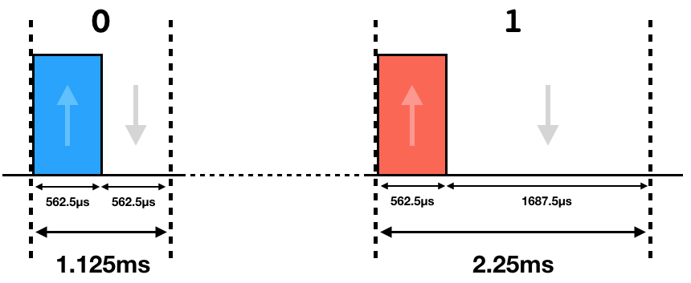
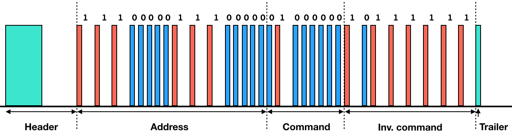
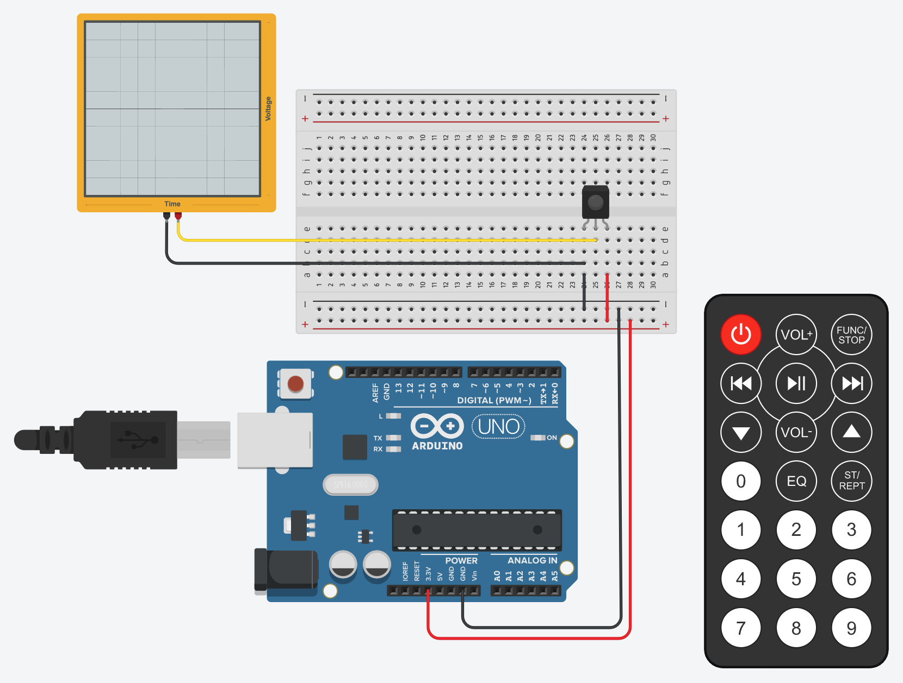

Building your own SAMSUNG Service remote
========================================

Disclaimer: This post is not about hacking or technical novelty. This is just a example of signal analysis to illustrate the application and usage of a logic analyzer.

Two years ago, I bought a SAMSUNG TV. Unfortunately, the model I got (KU6179) does not offer [PVR](https://whatis.techtarget.com/definition/personal-video-recorder-PVR) and [TimeShift](http://www.samsung.com/au/support/skp/faq/801471). However, it seems that the functionalities are actually present in the firmware but not activated. The restrictions are based on the model name. After a few Google searches, I found out the model name can be changed in memory thanks to a "service remote", a remote used by SAMSUNG technicians. I therefore bought a service remote (like, casually, on Amazon), followed the online tutorial, changed the name and managed to enable PVR and TimeShift. Once the operation done, I thought how stupid it is to buy a 25€ remote simply to send one (actually two) single "special" infrared (IR) message to open a "secret" menu. I thus decided to have a look at what is actually sent by the remote and release an Arduino sketch/code so that anyone could do the same with a cheap IR transmitter and an Arduino.

> _Note_: I could have simply used a free mobile app on an android phone to send the signal but my Google search back then didn't show the option (2 years ago).


Infrared radiation (IR)
-----------------------

TV remote uses infrared LED to carry the signal to the TV. Infrared light is invisible to the human eye and has several advantages over other wireless technologies:

* Cheap hardware
* No license
* Low complexity
* Low power consumption

Each button on your remote control correspond to a command (a 8-bit binary value). Whenever you press a button, the following packet is generated:

* __Header__: This basically means "IR COMMAND COMING THROUGH!". It consists of a 4.5ms IR LED on followed by a 4.5ms IR LED off.
* __Address__ for the receiving device: In this case, for my TV (and maybe all SAMSUNG TV?) I have 0xE0E0.
* __Command__: The value of the button pressed.
* __Inverted command__: The command but bitwised, i.e. 0s become 1s and 1s become 0s.
* __Trailer__: This basically means "I'm good, command sent!". It consists of a 0.5625ms IR LED on.

Beside the header, the packet format is structured exactly like the [extended NEC](https://www.sbprojects.net/knowledge/ir/nec.php) protocol.

The binary data (address, command and inverted command) is not simply transmit as `1` = IR LED on, `0` = IR LED off. Instead, the binary is encoded as follow:

* `0` = 0.5625ms ON followed by 0.5625ms OFF
* `1` = 0.5625ms ON followed by 1.6875ms OFF



Here is an example for the button "Power on/off" button from my remote. The command value is "0x40", so the final packet will be:



When I mentioned "0.5625ms ON", this doesn't mean the IR LED keep emitting a solid ON signal. In order to reduce the power consumption (and make it easier to filter the signal from the light noise), the IR LED constantly switches on and off at a 38kHz frequency. This is called Pulse Width Modulation (PWM). Fortunately, the IR receiver comes with a decoder that filters out the 38kHz signal so that we get the initial packet not modulated.

More info:

* https://www.sbprojects.net/knowledge/ir/nec.php
* https://techdocs.altium.com/display/FPGA/NEC+Infrared+Transmission+Protocol
* https://learn.adafruit.com/ir-sensor/ir-remote-signals
* https://learn.sparkfun.com/tutorials/pulse-width-modulation/all
* https://www.youtube.com/watch?v=BUvFGTxZBG8


Signal analysis
---------------

In order to sniff and analyze the signal from the TV remote, I bought a infrared receiver and connected it to my [cheap](https://www.amazon.de/dp/B01MUFRHQ2/) logic analyzer. Unlike a [photocell](https://learn.adafruit.com/photocells/overview), an infrared receiver needs to be powered up and has a pin (Rx) that outputs a digital high value unless it receive an infrared signal. So basically, if the IR LED of your remote is on, the output pin (Rx) of your receiver is 0v, otherwise the output is 3.3v (or 5 depending on Vcc). I used my [Arduino](https://store.arduino.cc/arduino-uno-rev3) as power supply (3.3v) for the receiver.



If you are not familiar with logic analyzers, see it as the Wireshark for electronic. A typical logic analyzer has multiple channels (in my case 8 channels) that you can hook to a pin/trace/cable that carries a signal, and it then sends the probed signal to an application that renders (and sometimes decodes) it. You usually use a logic analyzer for digital signal but some are good enough (not mine) to be used as a decent oscilloscope to analyze analog signals. If you want a good logic analyzer, I would highly recommend the [Saleae](https://www.saleae.com).

The first step before capturing the signal is to define the sampling rate, i.e. how often are we going to measure the voltage per second. Here, in this example, since the shortest time a state (ON or OFF) could last is 0.5625ms, it means in 1 seconds we could have a maximum 1/(0.5625 x 10^-3) = ~1778 state changes. In order to measure (and thus capture) all of those changes, I need my logic analyzer to sample the signal at a rate higher than 1778 samples per second. Good news everyone, the slowest sampling rate of my logic analyzer is 25k samples per second, which is already way enough.

In order to capture the signal, I hooked channel 1 to the IR receiver output (Rx), then configured the [Logic](https://www.saleae.com/downloads/) application to start (trigger) capturing the signal as soon as it identifies a falling edge. Why so? Because the packet header starts with a 4.5ms ON, but since the IR receiver output 0, when the signal emitter is ON, I want to start recording as soon as the signal change from 1 (3.3v) to 0 (0v).

<iframe src="https://player.vimeo.com/video/315442056" width="640" height="216" frameborder="0" webkitallowfullscreen mozallowfullscreen allowfullscreen></iframe>

We can see in the video that the logic analyzer automatically stats recording as soon as it receive the signal from my remote. Since I kept pressing the power button, the signal just repeated.

Then I just had to capture the signals for the "secret" menu on the remote, which consists of "INFO" button and "FACTORY":


Which means:

* _Info_: `1110 0000 1110 0000 1111 1000 0000 0111`
* _Factory_: `1110 0000 1110 0000 1101 1100 0010 0011`


Repeating messages
------------------

We've seen in the previous chapter that the protocol used to transmit the command is not signed and doesn't have any incremented counter or random values. We also know this is a one way communication. This means if the signal is simply repeated, it would work. So technically, I don't need to know the protocol, the meaning of each bits, the frequency, or anything. I simply need to capture and retransmit the signal. So the last chapter was kind of pointless, but I hope you've learned a least one or two things.

Since we've been so far, let's create a SAMSUNG Service Remote with our Arduino. For this, I first removed one IR LED from my [MiPosaur](https://www.amazon.de/dp/B00VFZDOC0/) and connected it to my Arduino on the digital PIN 13. PIN 13 is handy cause it has an internal resistor, so no need to add additional one. Below is the sketch I uploaded to my Arduino. I tried to comment it to make it easier to read.

```
#define IRLEDpin 13 // IR LED connected to PIN 13

// For this example, I used the packet "Power ON/OFF"
char address[] = "1110000011100000";
char command_power[] = "0100000010111111";
char command_info[] = "1111100000000111";
char command_factory[] = "1101110000100011";


void sendON(float);
void sendOFF(float);
void writeHeader();
void writeBinary(char []);
void writeTrailer();
void sendPacket(char [], char []);


void setup()
{
  Serial.begin(9600);
  pinMode(IRLEDpin, OUTPUT);
}


void loop()
{
  digitalWrite(IRLEDpin, LOW); // Switching off the LED
  delay(3000);
  Serial.println( "Sending power signal..." );
  sendPacket(address, command_power);
  delay(2000);
  Serial.println( "Sending info signal..." );
  sendPacket(address, command_info);
  delay(2000);
  Serial.println( "Sending factory signal..." );
  sendPacket(address, command_factory);
  while(1);
}


void sendON(float ms)
{
  // I need to know how many time will it go ON and OFF.
  // 38kHz means 38000 times per second, or 38 times per millisecond

  float counter = 38 * ms;

  for( int i = 0; i < counter; i++ )
  {
    // For each cycle, I want to have ON during the first half
    // and OFF during the second half.
    // 1 seconds = 38000 cycles
    // 1 / 38000 = 1 cycle
    // (1 / 38000) / 2 = 1/2 cylce = duration of ON
    // 13,15789474 ms

    digitalWrite(IRLEDpin, HIGH); // IR LED ON

    // digitalWrite takes about 4 micro seconds to execute
    // Therefore, we need to subtract this processing time from the pause

    delayMicroseconds(13 - 4); // Keeping IR LED ON for 13 microseconds
    digitalWrite(IRLEDpin, LOW); // IR LED OFF
    delayMicroseconds(13 - 4); // Keeping IR LED OFF for 13 microseconds
  }
}


void sendOFF(float ms)
{
  // OFF is basically sending nothing and wait
  // sendON() always ends with LOW signal
  // so no need to use digitalWrite(IRLEDpin, LOW)
  delayMicroseconds(ms * 1000);
}


void writeHeader()
{
  sendON(4.5);
  sendOFF(4.5);
}


void writeBinary(char bin[])
{
  for( int i = 0; i < 16; i++ )
  {
    sendON(0.5625);
    if( bin[i] == '0' )
      sendOFF(0.5625);
    else if( bin[i] == '1' )
      sendOFF(1.6875);
    else
    {
      Serial.println( "Error in the packet..." );
      break;
    }
  }
}


void writeTrailer()
{
  sendON(0.5625);
}


void sendPacket(char address[], char command[])
{
  writeHeader();
  writeBinary(address);
  writeBinary(command);
  writeTrailer();
}
```


Wrap up
--------

In the end, nothing too crazy, just an excuse to play with my Arduino and briefly introduce the logic analyzer, a really useful tool+software I use when doing pentest on IoT devices. If you want more blog posts about electronic or IoT, let me know and I'll try to find some time to write about debug interfaces (UART, JTAG, etc) and firmware exploitation.
